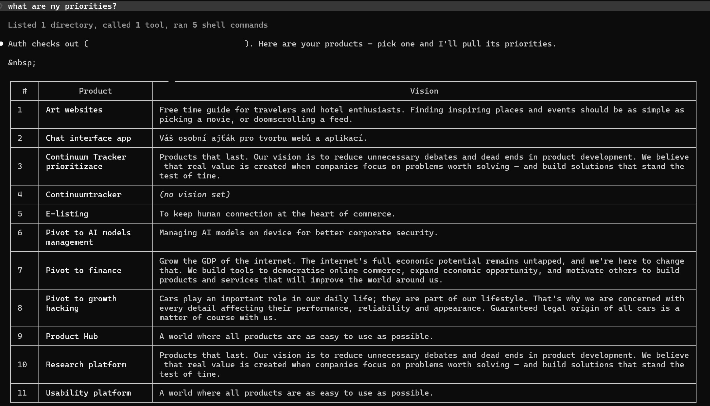
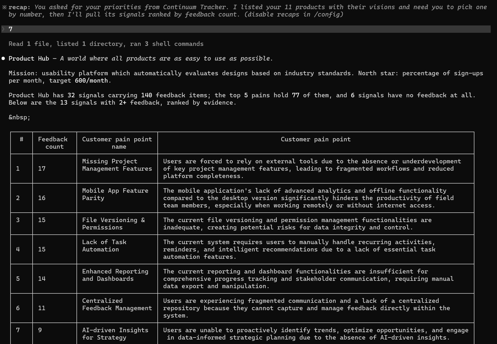
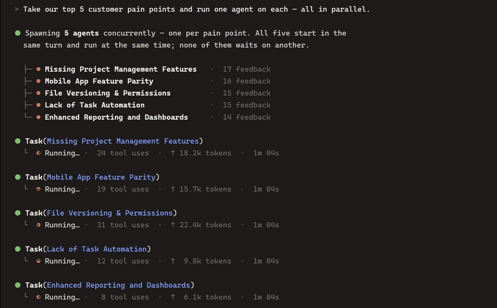

<p align="center">
  <a href="https://www.continuumtracker.com">
    <picture>
      <source srcset="./assets/logo.png">
      
    </picture>
  </a>
</p>

# Continuum Tracker for Claude Code

<p align="center">
  <a href="./LICENSE"></a>
  <a href="https://www.continuumtracker.com"></a>
  <a href="https://github.com/anthropics/claude-code"></a>
  
  
  
</p>

**This Claude Code skill helps you manage product context across all your products, so you can quickly discover valuable ideas, uncover new growth opportunities, and test them in minutes by tapping directly into your Continuum Tracker data.**

Point Claude Code at your [Continuum Tracker](https://www.continuumtracker.com) account and it reads your products, your evidence-ranked customer pain points and the market research behind each one — then turns the winner into a clickable prototype with an audit trail of *easoning and changes*.


    
---

## Key features

| | Capability | What it means in practice |
|---|---|---|
| 🔌 | **Query Continuum Tracker data** | Access market data (currently 41 000 pain points and their products) and your own data. |
| 🛰️ | **AI agent per product** | Dedicate AI agents to work on pain points in parallel. Find product growth opportunities faster. |
| 🔬 | **Deep market + customer research** | What your users actually said, where the market is going (dates and similarity scores included). |
| ⚡ | **Rapid prototypes, auditable** | Prototype app in minutes for each of your customer pain point (market reasoning included). |
| 🧭 | **Customer journey investigation** | Map the customer journey and identify market-validated improvements for every pain point. |
| 📈 | **Auditing decisions** | Every prototype change or decision can bre audited and used for futute learning. |

---
## Agentic product development
Continuum Tracker continuously manages your product context, prioritising customer pain points using real customer feedback and validating them against market insights. Instead of synthesising context, founders and product teams can focus on one question: Which opportunities will have the greatest impact? 

Visit [Agentic AI product developemnt](https://www.continuumtracker.com/produktova-prioritizace-s-agentni-ai/) for more information. 

### Prioritization "What to built next"
> Ask "What to uilt next?"
> and the skills deliveres prioritized list of your products and potential custoemr pain poitns to solve.
>

**Products list**
<picture>
  <source srcset="./assets/priorities.jpg">
  
</picture

**Customer pain points list per one product**
<picture>
  <source srcset="./assets/painpoints.jpg">
  
</picture>

### Synthetised customer problems understanding
Run deep research analysis to synthesise market and customer data, uncovering the most critical user pain points and opportunities.

**Auto evidence form customers analysis**
<picture>
  <source srcset="./assets/version control 1.jpg">
  
</picture>

**Auto market evidence analysis**
<picture>
  <source srcset="./assets/version control 2.jpg">
  
</picture>

**Auto customer journey analysis and its enhancements**
<picture>
  <source srcset="./assets/version control 3.jpg">
  
</picture>

**Auto code enhancements analysis based on new customer journey**
<picture>
  <source srcset="./assets/version control 4.jpg">
  
</picture>

## Product Growth Hacking
Use automatically synthesised customer and market insights to test value propositions through rapid prototyping.

### Building prototypes
Turn customer pain points into prototypes in minutes and validate their value proposition through testing.

**Auto dashboard for managing prototype new and old customer journey**
<picture>
  <source srcset="./assets/prototype 1.jpg">
  
</picture>

**Auto visual onboarding to suggested enhancements to the customer journey**
<picture>
  <source srcset="./assets/prototype 2.jpg">
  
</picture>

### Auditing prototes
Track every prototype iteration with audit trails, enabling teams to learn from changes, detect bias, and understand which solutions create the most value.

**Auto auditing for changes, plus manual entry if needed**
<picture>
  <source srcset="./assets/prototype 3.jpg">
  
</picture>

### Running product AI agents in parallel
Move from sequential product development to **parallel exploration**. AI agents build and test competing solutions simultaneously, allowing teams to discover faster which customer pain points, value propositions, and products have the highest potential.

This workflow is designed for **founders who need to pivot quickly, explore new opportunities, and move faster** than traditional product development allows.

**Run multiple product development efforts in parallel**
<picture>
  <source srcset="./assets/agents.jpg">
  
</picture>

## Setup
1. Get an API key from the web app at **`/settings/access`** (Bearer key with the `ct_` prefix).

2. Provide it in one of two ways:
   - Set the environment variable:
     ```bash
     export CONTINUUM_API_KEY=ct_...
     ```
   - Or copy `.env.example` to `.env` in your working directory and add your API key.
   - If neither is configured, the skill will prompt you to paste the key.

> **Security:** Your API key is never stored, echoed, or committed by the skill.

## Usage

Just ask, in natural language:

- *"What are my priorities?"* / *"What should I build next?"*
- *"Show me my top pain points and how the market solves them."*
- *"Why is ‹pain point› a problem? Show me the evidence."*
- *"Prototype the ‹pain point› signal."*
- *"Continue the ‹pain point› prototype."*

Or invoke it explicitly with `/ct`.

## Requirements

| | Needed for |
|---|---|
| **Python 3.8+** *or* **Node 18+** | Running the API helper. No third-party packages either way. |
| **Node 18+** | Additionally, to run a generated prototype (Vite + React). |
| **Claude Code** | The host. |

## Scope and limits

- **Read-only.** No data is created, updated or archived in Continuum Tracker. Use [integrations](https://www.continuumtracker.com/integrations/) for that data ingestion.
- **Prototypes never touch your product.** They are placed in `Product management/` folder in root directory, which is added to `.gitignore` on creation.
- There are enforced rate-limits on query for safety purposes. For more visit **`/settings/access`** inside the [continuumtracker.com](https://www.continuumtracker.com) app.

## License

**MIT** — see [LICENSE](./LICENSE).

If you build on this, fork it, or ship something derived from it, please **reference [continuumtracker.com](https://www.continuumtracker.com)**. Attribution isn't a license condition beyond the MIT notice — it's a polite request from us.

## Acknowledgments

- **Powered by** [Continuum Tracker](https://www.continuumtracker.com)
- **Built for** [Claude Code](https://github.com/anthropics/claude-code).
- **Inspired by** thousands of products that nobody used, and the endless hours their creators spent building them. 

<br>
<p align="center">
  <a href="https://www.continuumtracker.com">
    <picture>
      <source srcset="./assets/logo.png">
      
    </picture>
  </a>
</p>
